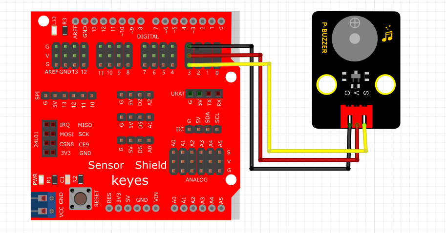

# Arduino


## 1. Arduino简介  

Arduino是一种开源电子原型平台，旨在为开发者和爱好者提供简便的工具，用于创建互动项目。Arduino系统包括硬件（各型号的开发板）和软件（Arduino IDE），支持多种编程语言，以Arduino C为主。使用Arduino，用户可以轻松连接各种传感器和执行器，实现实时控制和数据采集，广泛应用于教育、艺术和工程领域。  

Arduino的主要特点包括：  
- **开放源代码**：用户可以自由使用和修改Arduino的硬件和软件。  
- **丰富的社区支持**：大量的在线资源与教程，方便用户获取帮助和分享经验。  
- **易于上手**：直观的IDE和简单的编程语法，适合初学者快速入门。  
- **多功能性**：支持各种传感器与模块，能够轻松实现不同的功能。  

## 2. 连接图  

  

## 3. 测试代码  

```cpp  
int buzzer = 3; // 定义数字口3  

void setup() {  
    pinMode(buzzer, OUTPUT); // 将buzzer设置为输出  
}  

void loop() {  
    unsigned char i, j; // 定义变量i，j  

    while (1) {  
        for (i = 0; i < 80; i++) { // 输出一个频率的声音  
            digitalWrite(buzzer, HIGH); // 声音  
            delay(1); // 延迟1ms  
            digitalWrite(buzzer, LOW); // 无声  
            delay(1); // 延迟1ms  
        }  
        for (i = 0; i < 100; i++) { // 输出另一个频率的声音  
            digitalWrite(buzzer, HIGH); // 声音  
            delay(2); // 延迟2ms  
            digitalWrite(buzzer, LOW); // 无声  
            delay(2); // 延迟2ms  
        }  
    }  
}  
```  

## 4. 测试结果  

无源蜂鸣器内部不带振荡源，直流信号无法令其鸣叫，必须用方波才能驱动。本实验中，我们输入了两种频率的方波，使蜂鸣器发出不同的声音，实验中，两种声音循环交替。


