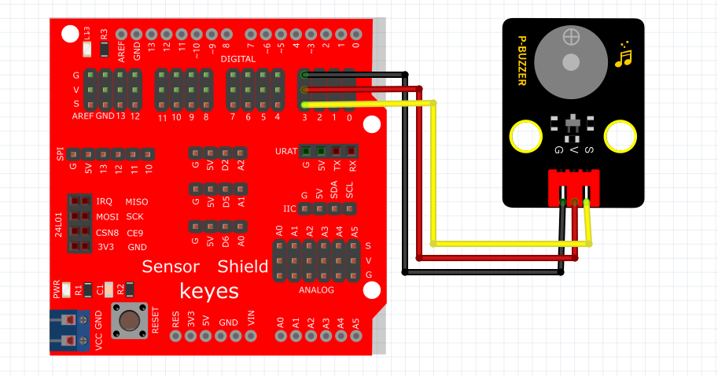

# Mixly

## 1. Mixly简介  

Mixly是一款图形化编程工具，旨在帮助初学者，尤其是儿童和青少年，轻松入门编程。它通过直观的拖拽方式，让用户能够快速创建程序，而无需深入学习复杂的编程语法。Mixly特别适配Arduino平台，支持硬件编程和控制，使得用户能够通过丰富的模块和示例实现各种互动项目，如机器人、传感器控制和智能家居等。同时，Mixly的用户界面友好，教育资源丰富，非常适合教学和个人探索。  

Mixly的主要特点包括：  
- **图形化编程**：简单的拖拽式界面，使编程变得容易理解和实现。  
- **支持多种硬件**：与Arduino等多种硬件平台兼容，便于扩展和实验。  
- **丰富的项目示例**：提供大量学习案例，帮助用户快速上手并应用所学知识。  
- **社区支持**：活跃的用户社区，提供技术支持和学习交流的平台。  

## 2. 连接图  

  

## 3. 测试代码  

1. 在控制栏拖出循环模块，并设置从0到80，每次加1的循环。  

     

2. 在输入/输出栏拖出数字输出模块，设置管脚3为高电平。  

     

3. 在控制栏拖出延时模块，并设置延时1ms。  

     

4. 在输入/输出栏拖出数字输出模块，设置管脚3为低电平。  

     

5. 在控制栏拖出延时模块，并设置延时1ms。  

     

6. 在控制栏拖出循环模块，并设置从0到100，每次加1的循环。  

     

7. 在输入/输出栏拖出数字输出模块，设置管脚3为高电平。  

     

8. 在控制栏拖出延时模块，并设置延时1ms。  

     

9. 在输入/输出栏拖出数字输出模块，设置管脚3为低电平。  

     

10. 在控制栏拖出延时模块，并设置延时1ms。  

      

## 4. 测试结果  

无源蜂鸣器内部不带振荡源，直流信号无法令其鸣叫，必须用方波才能驱动。在本实验中，我们输入了两种频率的方波，使蜂鸣器发出不同的声音，实验中，两种声音循环交替。

