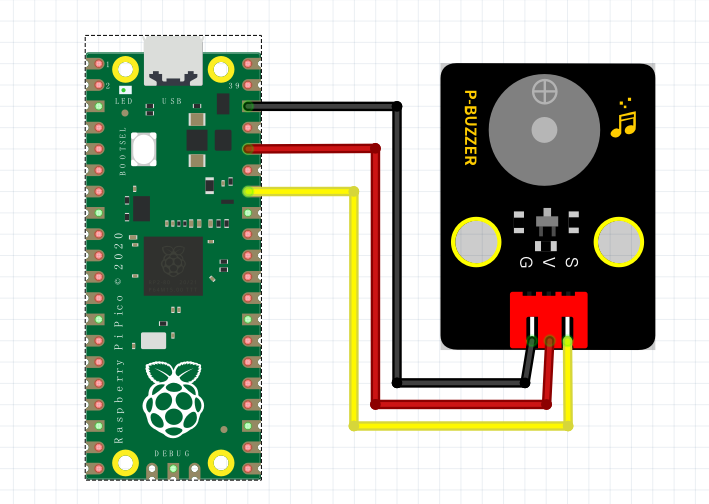

# Python


## 1. Python简介  

Python是一种高级编程语言，以其简单清晰的语法和强大的功能受到开发者的广泛欢迎。它支持多种编程范式，包括面向对象、命令式和函数式编程。Python被广泛应用于数据分析、人工智能、web开发、自动化测试等领域。其丰富的库和框架，如NumPy、Pandas和Flask，使得开发者能够高效地进行复杂的计算和构建应用。Python的易用性和可读性使得它成为初学者和专家的首选语言，并在教育领域得到了广泛的应用。  

## 2. 连接图  

  

## 3. 测试代码  

```python  
import machine  
import utime  

buzzer = machine.Pin(28, machine.Pin.OUT)  # 设置28脚为蜂鸣器输出脚  
val = 0  # 定义一个变量  

while True:  
    while val < 80:  # 变量大于80退出循环  
        val += 1  # 变量加一  
        buzzer.value(1)  # 设置28脚为高电平，蜂鸣器响  
        utime.sleep_ms(1)  # 设置延时1ms  
        buzzer.value(0)  # 设置28脚为低电平，蜂鸣器关  
        utime.sleep_ms(1)  # 设置延时1ms  

    val = 0  # 变量清零，不然无法正常运行下一个循环  

    while val < 100:  # 另一个声音，次数和频率与第一个不一样  
        val += 1  
        buzzer.value(1)  
        utime.sleep_ms(2)  
        buzzer.value(0)  
        utime.sleep_ms(2)  

    val = 0  
```  

## 4. 测试结果  

无源蜂鸣器内部不带振荡源，直流信号无法令其鸣叫，必须用方波才能驱动。本实验中我们输入了两种频率的方波，使蜂鸣器发出不同的声音，实验中，两种声音循环交替。


